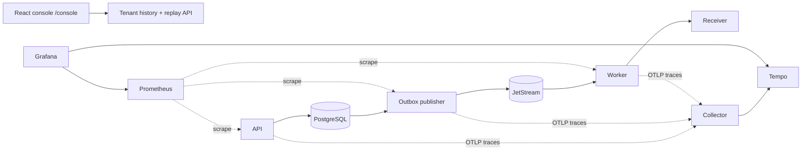

# HookRelay architecture

This document is cumulative through Stage 6 (`0.6.0`). It describes current
behavior and labels roadmap work explicitly. HookRelay provides at-least-once
delivery with persistent bounded recovery; it does not claim exactly once,
high availability, production security, or benchmark scale.

## Current system: Stage 6 observability and operations

```text
Deployment operator                         Producer
        |                                      |
        | bootstrap token                      | tenant API key
        v                                      v
+-------------------------- FastAPI / Uvicorn ---------------------------+
| request cap | tenant scope | endpoints/events | history/replay/console |
+--------------------------------+---------------------------------------+
                                 |
                 endpoint create | URL + DNS/IP preflight
                                 | event + N delivery snapshots
                                 | + N generation-1 outbox rows
                                 | one PostgreSQL transaction
                                 v
             +---------------- PostgreSQL ----------------+
             | source of truth                            |
             | event / delivery / attempts / outbox       |
             | generation / due / claim / terminal        |
             | endpoint rate window / circuit / probe     |
             +--------^-------------------------^---------+
                      |                         |
             claim / publish / mark      claim / finish / recover
                      |                         |
              +-------+--------+                |
              | outbox publisher|               |
              +-------+--------+                |
                      | strict ID-only schema v1 |
                      v                          |
              +-----------------+ durable pull  |
              | NATS JetStream  |--------------+
              | work queue      |               v
              +-------^---------+       +---------------------------+
                      |                 | bounded delivery worker   |
                      | delayed NAK     | rate/circuit row lock     |
                      +-----------------+ DNS/IP pin + peer verify  |
                                        +------------+--------------+
                                                     | HMAC-signed HTTP
                                                 v
                                        +------------------+
                                        | local receiver   |
                                        | exact-byte ledger|
                                        +------------------+

dead_lettered -- authenticated replay transaction --> generation + 1
               + fresh outbox UUID --> publisher --> JetStream

endpoint v1 secret -- authenticated optimistic rotation --> retired v1
                  + active v2; accepted deliveries retain their version IDs
```

The API, publisher, worker, and receiver are independent processes. Broker,
destination, or worker failure does not become a synchronous dependency of
`POST /v1/events`. PostgreSQL remains the durable acceptance and recovery
boundary.

## Runtime components and ownership

| Component | Owns | Does not own |
| --- | --- | --- |
| FastAPI application | Request-byte cap, authentication, tenant scope, endpoint destination preflight, signing-secret rotation, idempotent ingestion, reads/replay, PostgreSQL readiness | Broker publication, HTTP execution, migrations, NATS health |
| PostgreSQL | Authoritative event/delivery/attempt/outbox state, retry due time, generation, claims, terminal reason, and shared per-endpoint rate/circuit/probe state | Remote side effects, network egress enforcement, or NATS cursor state |
| Outbox publisher | Short expiring claims, ID-only publication, PubAck-before-finalize | Ingestion, attempt/retry policy, HTTP |
| NATS JetStream | Durable dispatch message, delayed wake-up, shared consumer ACK state | Event bodies, URLs, secrets, retry budget, terminal domain state |
| Delivery worker | Durable pull, authoritative reconciliation, shared rate/circuit admission, attempt lease/recovery, signing, policy-enforcing IP-pinned HTTP, classification, ACK/NAK/TERM decision | External firewall/egress policy, receiver idempotency, production capacity |
| Test receiver | Configurable local response and bounded exact-byte capture | Durable audit, signature enforcement, customer behavior |
| Operations console | Same-origin tenant delivery history, attempt inspection, and confirmed single replay | Browser credential persistence, payload/URL access, system configuration |
| OpenTelemetry Collector and Tempo | Failure-isolated trace routing and local trace storage | Product correctness, health, durable delivery state |
| Prometheus and Grafana | Bounded process metrics and provisioned operational views | Per-delivery audit, billing, production SLO evidence |
| SQLAlchemy async engine | One connection pool per database-using process | A shared global session |
| Alembic | Ordered reviewed schema transitions and data backfill | Automatic process-start migration |

Database operations use short `AsyncSession` units. No transaction spans NATS
or HTTP I/O. Outbox and delivery claims commit before their external operation;
later conditional updates prove ownership.

## Stage 6 observability and operations plane

The observability plane is adjacent to the data plane. It is never consulted to
decide whether an event is accepted, whether a delivery is due, or whether a
broker message can be acknowledged.



The API binds a canonical correlation UUID in a `ContextVar`, returns it as
`X-Correlation-ID`, and adds it to structured logs. A valid W3C parent starts
the server span. Event/replay transactions store correlation UUID and
`traceparent` beside each outbox row. Publication restores that parent and
injects the active context into optional NATS headers. The strict schema-v1
JSON payload and signed receiver request do not change; missing telemetry
headers remain valid.

Each process owns a custom Prometheus registry. Labels use reviewed bounded
vocabularies only. Tenant, event, endpoint, delivery, URL, event type, raw path,
exception, and unrestricted error values are forbidden metric labels.

Delivery history is ordered by `(created_at DESC, id DESC)`. Cursors are
versioned, filter-bound pagination state, never authorization. Every list,
detail, and attempt query independently applies the authenticated tenant ID.
Public schemas omit payloads, URLs, signing-secret identity/ciphertext, API-key
identity, claim tokens/expiry, broker payloads, and exception text.

## Public and local HTTP surfaces

Tenant identity always comes from a verified API key. Mutation routes with JSON
bodies require `Content-Type: application/json`; stable failures use sanitized
`application/problem+json`. A pure ASGI boundary counts actual body chunks
before routing or JSON parsing; the default maximum is 1,048,576 bytes.

| Route | Scope | Meaning of success |
| --- | --- | --- |
| `GET /health/live` | public | Process/event loop responds; no dependency call |
| `GET /health/ready` | public | Bounded PostgreSQL `SELECT 1` succeeds |
| `POST /v1/bootstrap/tenants` | deployment bootstrap bearer | Tenant and one-time initial key committed |
| `GET /v1/tenant` | tenant key | Authenticated tenant metadata |
| `POST /v1/endpoints` | tenant key | Endpoint and one-time signing secret committed |
| `GET /v1/endpoints/{id}` | tenant key | Secret-free tenant-owned endpoint metadata |
| `POST /v1/endpoints/{id}/signing-secret/rotate` | tenant key | Active version replaced atomically; one-time replacement secret returned |
| `POST /v1/events` | tenant key + idempotency key | Event, delivery snapshots, and generation-1 outbox rows committed |
| `GET /v1/events/{id}` | tenant key | Current status, dispatch generation, retry due time, and terminal reason |
| `GET /v1/deliveries` | tenant key | Filtered, keyset-paginated current delivery history |
| `GET /v1/deliveries/{id}` | tenant key | Safe delivery detail plus attempt summary |
| `GET /v1/deliveries/{id}/attempts` | tenant key | Lifetime-ordered attempt history across generations |
| `GET /v1/deliveries/{id}/attempts/{attempt_id}` | tenant key | One safe attempt detail |
| `POST /v1/deliveries/{id}/replay` | tenant key | `202`; dead-lettered delivery reset to pending in a fresh generation/outbox transaction |
| `GET /metrics` | local/internal | API process custom Prometheus registry |
| `GET /console/` | operator browser | Root-owned static operations console assets |

Replay requires JSON `expected_dispatch_generation` and includes
`Location: /v1/events/{event_id}`. Missing/cross-tenant delivery IDs are
indistinguishable `404`; changed generation returns
`409 delivery_generation_conflict`; a non-dead-lettered delivery returns
`409 delivery_not_replayable`.

Rotation requires JSON `expected_active_version`. A stale value returns
`409 signing_secret_version_conflict` plus
`HookRelay-Active-Secret-Version`; missing/cross-tenant endpoint IDs remain
opaque `404`. Successful creation and rotation secret responses use
`Cache-Control: no-store` and `Pragma: no-cache`.

The whole-request cap returns `413 request_body_too_large`. Event submission
also measures the parsed payload's compact sorted-key UTF-8 representation;
more than 262,144 bytes returns `413 event_payload_too_large` before ingestion.
The event cap is not a tenant storage quota, and a deployed ingress still needs
compatible outer limits and timeouts.

The local receiver exposes `/health/live`, `POST /webhooks`, `GET /requests`,
`GET /requests/{delivery_id}`, and `DELETE /requests`. It is not a product
service and loses its bounded in-memory evidence on restart.

## Durable ingestion and idempotency

Stage 2's boundary remains:

1. The ASGI body cap bounds bytes before FastAPI parsing; API-key
   authentication then derives tenant context.
2. The event route rejects an oversized canonical payload before ingestion. A
   versioned canonical fingerprint covers event type, payload, and endpoint
   set.
3. `(tenant_id, idempotency_key)` uniqueness plus PostgreSQL
   `ON CONFLICT DO NOTHING RETURNING` closes concurrent races.
4. Matching retry returns the original `201` creation representation and
   replay header; changed input returns `409`.
5. One transaction creates the immutable event, one pending delivery per
   endpoint, and one generation-1 outbox row per delivery.
6. Each delivery snapshots its target URL and exact signing-secret version.

`201` proves only that PostgreSQL committed acceptance and dispatch intent. The
creation representation remains the original pending view; authenticated event
GET returns later `delivering`, `retry_scheduled`, `succeeded`, or
`dead_lettered` state.

## Transactional outbox and dispatch generations

### Envelope compatibility

The internal command remains strict and ID-only. Version 1 contains:

```text
type, schema_version, message_id, tenant_id,
event_id, endpoint_id, delivery_id
```

Stage 4 does not add a broker field or version. Positive
`dispatch_generation` lives on delivery, attempt, and outbox database rows. The
worker first reconciles the seven message IDs/fields with the exact outbox row,
then derives that row's generation. Event payload, target URL, secret, and
generation remain outside NATS.

`message_id` equals the fresh outbox UUID and becomes `Nats-Msg-Id`. Outbox
uniqueness is `(delivery_id, topic, dispatch_generation)`: initial ingestion
creates generation 1, and each manual replay creates another row/UUID.

Keeping strict schema v1 prevents an old Stage 3 worker from TERMing a replay
message for an unknown field/version. This is only payload compatibility.
Manual replay should wait for Stage 4 worker cutover because an old worker can
parse the envelope but lacks generation fencing and may send a stale request.

### Publication

The publisher still:

1. scans eligible unpublished rows in stable order;
2. claims a bounded `FOR UPDATE SKIP LOCKED` batch with token/expiry;
3. validates the row/envelope schema and IDs while retaining generation on the
   PostgreSQL row;
4. commits before NATS I/O;
5. publishes sequentially and waits for the expected stream PubAck;
6. conditionally sets `published_at` using row ID and claim token;
7. releases still-owned claims after a handled failure or cooperative stop.

Claim TTL must exceed `batch_size * publish_timeout`, the aggregate configured
broker-wait budget. PubAck/finalization ambiguity still allows duplicate
publication. Finite-window `Nats-Msg-Id` deduplication reduces but cannot remove
it.

## JetStream topology and broker roles

Local Compose runs `nats:2.14.3-alpine3.22` with one named file volume.

### Stream

| Setting | Current value |
| --- | --- |
| Name | `HOOKRELAY_DELIVERIES_V1` |
| Subject | `hookrelay.delivery.requested.v1` |
| Retention/storage | Work queue / file |
| Full behavior | Reject new messages (`DiscardNew`) |
| Maximum message bytes | 16,384 |
| Default byte limit | 1 GiB |
| Duplicate window | 600 seconds |
| Replicas | One |

### Consumer

| Setting | Current value |
| --- | --- |
| Durable name | `HOOKRELAY_DELIVERY_WORKERS_V1` |
| Delivery | Pull, deliver-all, instant replay |
| Acknowledgment | Explicit |
| Default `AckWait` | 30 seconds |
| `MaxDeliver` | Unlimited (`-1`) |
| Default `MaxAckPending` | 32 |
| Filter | Exact delivery-requested subject |

`MaxDeliver=-1` is deliberate. Broker deliveries include due-time deferrals,
active-lease deferrals, and lost ACKs. PostgreSQL counts outbound or ambiguous
attempts and owns the maximum. The broker supplies durable transport and delayed
wake-ups, not the business retry ledger.

Every publisher/worker idempotently creates absent assets and rejects important
topology drift. One server/replica/volume provides local persistence, not
quorum, failover, backup, or HA.

## Worker state machine and attempt ownership

For each broker message, the worker locks the tenant-owned delivery and
reconciles the complete envelope with the outbox and domain rows.

### Generation and terminal gates

- Message generation below the delivery is stale: skip HTTP and ACK.
- Message generation ahead of PostgreSQL is poison: TERM.
- `succeeded` skips HTTP and ACKs.
- `dead_lettered` skips HTTP and ACKs.

### Due-time gate

For `retry_scheduled`, PostgreSQL `clock_timestamp()` is compared with
`next_attempt_at`.
An early message creates no attempt and receives a delayed NAK for the remaining
time. Due work proceeds only if current-generation attempts remain below the
configured maximum.

### Attempt lease

One short transaction creates an attempt with lifetime number, current
generation, and random claim token; copies the token to the delivery; sets
database-time expiry; changes state to `delivering`; and commits. A partial
unique index allows one unfinished attempt per delivery.

Default delivery claim TTL is 20 seconds and must exceed the ten-second HTTP
timeout plus the explicit five-second finalization margin. Claim and due checks
use PostgreSQL `clock_timestamp()` so wall time is not frozen at transaction
start. An unexpired claim causes a delayed NAK for its remaining lease rather
than another HTTP request. Attempt duration is `BIGINT` so long-stale recovery
cannot overflow 32-bit milliseconds.

After expiry, recovery marks the unfinished row `abandoned` with
`worker_lease_expired`, counts it against the current-generation budget, clears
the claim, and schedules or dead-letters. A finalizer must match attempt,
generation, token, delivering state, and unexpired lease. A late worker is
fenced with no stale-handle broker disposition.

## Retry, classification, and terminal policy

### Classification

| Observation | Outcome |
| --- | --- |
| `2xx` | Success |
| `408`, `425`, `429`, `5xx` | Transient failure |
| Request timeout or async HTTP transport error | Transient failure |
| Other HTTP status | Permanent failure |
| URL rejected before admission | Terminal `target_blocked`, without HTTP attempt |
| DNS/IP/peer rejected after an attempt claim | Attempt finishes `permanent_failure` with error code `target_blocked`; terminal delivery reason `target_blocked` |

Stage 5 still does not follow redirects or honor `Retry-After`.

### Backoff

For current-generation attempt `n`:

```text
ceiling    = min(retry_max, retry_base * 2^(n - 1))
multiplier = (1 - jitter_ratio) + jitter_ratio * U  # U uniform [0, 1]
delay      = max(0.1, ceiling * multiplier)
```

Defaults are base 1 second, cap 60 seconds, ratio 0.25, and maximum five
attempts per dispatch generation. The resulting due time and failed attempt
commit together before delayed NAK. A generation-specific count drives policy;
lifetime attempt number never resets.

### Terminal state

Permanent response dead-letters immediately. Transient/abandoned work
dead-letters when attempts are exhausted. A blocked target dead-letters as
`target_blocked` before any HTTP attempt. Terminal state requires
`dead_lettered_at` and one of:

```text
permanent_failure | attempts_exhausted | target_blocked
```

The broker message is ACKed after the terminal transaction commits. A separate
dead-letter stream does not exist.

## Broker disposition matrix

| Executor/boundary | Disposition |
| --- | --- |
| `succeeded`, `already_succeeded` | Synchronous ACK |
| `dead_lettered` | Synchronous ACK after terminal commit |
| Old-generation `stale` | Synchronous ACK |
| `retry_scheduled` | Delayed NAK using policy delay |
| Active-lease `in_progress` | Delayed NAK using remaining lease |
| Target-blocked persisted by executor | Terminal ACK |
| Target-block exception before persistence | Fixed delayed-NAK fallback |
| Malformed/contradictory internal message | TERM |
| Lost claim / stale finalizer | No stale-handle disposition |
| Unexpected interruption | No disposition; broker recovery remains available |

This ordering chooses duplicate observation over ACK-before-state silent loss.

## Versioned webhook wire contract

Stage 5 preserves webhook contract version 1. The compact sorted-key UTF-8 body
contains original event time, stable event ID, delivery ID, payload, schema
version, and type. The HMAC remains:

```text
v1=hex(HMAC-SHA256(secret, ASCII(unix_seconds) + b"." + exact_body_bytes))
```

Headers remain content type, service `User-Agent`, delivery ID, stable event
ID, signature, timestamp, and webhook version. `User-Agent` now reports
`HookRelay/0.6.0`; it is not part of the signed content.

HMAC authenticates exact bytes and possession of the snapshotted secret. It
does not encrypt payloads, prove freshness alone, or deduplicate receiver side
effects. A receiver must verify raw bytes with constant-time comparison, apply
a timestamp window, and atomically deduplicate the stable event ID.

## Manual dead-letter replay

`POST /v1/deliveries/{id}/replay` locks the delivery within authenticated tenant
scope. Only `dead_lettered` is eligible. In one transaction it:

1. increments `dispatch_generation`;
2. sets `pending` and clears schedule/terminal/claim fields;
3. creates a new schema-v1 outbox row/UUID whose row stores the new generation;
4. commits before returning `202` and the event `Location`.

The fresh UUID avoids reusing an ACKed message and JetStream's duplicate window.
Old-generation messages are ACKed as stale. Lifetime attempts and old outbox
rows remain intact; the new generation receives a fresh bounded budget.

Replay is not idempotency-keyed. Its required observed-generation precondition
and row lock ensure one ambiguous operator intent advances at most once. A
duplicate/stale body returns `409 delivery_generation_conflict`; current event
detail exposes generation, due time, and terminal reason for reconciliation.
`202` is dispatch acceptance, not delivery success.

## Ingress byte boundaries

`RequestBodyLimitMiddleware` sits outside FastAPI routing. One all-digit
`Content-Length` is an early rejection hint; decimal digit-length and
lexicographic comparison avoid parsing a pathologically large integer. A
declared overage returns an immediate sanitized `413`, while duplicate or
malformed hints fall through to authoritative counting of actual ASGI body
chunks. The middleware buffers and replays at most the configured bound, so an
absent, false, or chunked length cannot bypass the one-MiB default. An actual
overage also returns `413` before authentication, route dependencies, or JSON
parsing.

After `EventCreate` validation, `POST /v1/events` encodes only `payload` as
compact, sorted-key, non-ASCII-escaped UTF-8 and enforces the 256-KiB default
before `ingest_event()`. These two controls bound application input; they do not
replace reverse-proxy limits, slow-client timeouts, tenant quotas, or storage
capacity planning.

## Outbound destination boundary

### Endpoint creation

`POST /v1/endpoints` normalizes the HTTP(S) URL, rejects userinfo/fragments and
unsafe literal IPs, and requires HTTPS in staging/production. For public
hostnames it resolves all A/AAAA answers under a two-second default deadline
and fails closed if any answer is invalid, non-global, private, loopback,
link-local, multicast, reserved, unspecified, metadata, IPv4-mapped IPv6, or a
blocked transition range. The explicit transition denylist includes deprecated
IPv4 `192.88.99.0/24` plus NAT64, Teredo, ORCHIDv2, and 6to4 IPv6 ranges.
Validation failure is a sanitized `422 destination_not_allowed` and creates no
endpoint rows.

Exact normalized `HOOKRELAY_DELIVERY_ALLOWED_HOSTS` entries are deliberate
private-address exemptions for local/test receivers only. They never suffix-
match, and staging/production settings reject a non-empty set. Local/test
creation skips DNS preflight for an exact exemption because Compose service DNS
is runtime-local; the worker still resolves it at connection time.

### Connection-time validation and pinning

Every new outbound connection revalidates URL policy, resolves every answer,
rejects a mixed safe/unsafe set, chooses a validated numeric IP, connects to
that IP, and verifies the socket peer equals it. The original hostname remains
the HTTP `Host` value and HTTPS SNI/certificate name. The custom transport keeps
connections non-reusable, forbids Unix sockets, disables redirects, ignores
environment proxies, and uses normal certificate verification. Resolving and
connecting to the same selected IP closes the usual validate-then-resolve DNS
rebinding gap inside this client.

A URL rejected before traffic admission becomes `target_blocked` without an
attempt. A connection-time DNS/IP/peer rejection happens after a claimed
attempt, which finishes `permanent_failure` with error code `target_blocked` as
the delivery takes terminal reason `target_blocked`. In either case terminal
state commits before ACK and can be manually replayed after a reviewed
correction.

The transport is not an external sandbox. Production still needs
deny-by-default egress/firewall policy, metadata controls, trusted DNS and CA
configuration, monitoring, and tests in the deployed network. It protects
HookRelay's configured HTTP path, not every possible future socket-using
dependency or a compromised process.

## Shared per-endpoint traffic controls

Every endpoint has one `endpoint_traffic_controls` row keyed by
`(tenant_id, endpoint_id)`. The worker locks the delivery and then this shared
row, then reads a fresh PostgreSQL `clock_timestamp()` after any lock wait for
one atomic admission decision across worker processes.

- The fixed window permits ten admitted requests per endpoint per one-second
  window by default. State resets at the exact database-time boundary.
- A full window persists the delivery as `retry_scheduled` until the window
  end. It creates no attempt, opens no socket, and spends no attempt budget.
- Transient attempt completions increment a consecutive-failure count. Success,
  a permanent response, or a target-policy result proves reachability or a
  non-transient decision and closes/resets the circuit.
- Five transient failures open the circuit by default. Open work defers to the
  30-second cooldown without an attempt.
- At cooldown, the locked row leases exactly one half-open probe using the same
  token/expiry as its delivery claim. Competing work defers to probe expiry
  without an attempt. Probe success closes; transient failure or abandoned
  probe reopens and starts another cooldown.

All deferrals commit `retry_scheduled`/`next_attempt_at` before delayed NAK;
PostgreSQL remains authoritative if the broker wakes early or late. Probe
admission consumes a rate-window slot. This is a simple fixed-window overload
guard, not a smooth token bucket, tenant billing quota, distributed capacity
measurement, or downstream SLA.

## Snapshot-safe signing-secret rotation

The authenticated rotation route locks the tenant-owned endpoint and active
secret. It compares `expected_active_version`, uses database time to retire the
old row, inserts `version + 1`, and commits both changes atomically. A partial
unique index permits one active secret per endpoint. Concurrent requests with
the same expected version produce one winner and one safe `409`.

Old encrypted rows are retained because accepted deliveries reference the
exact secret row. Work accepted before rotation therefore keeps signing with
the old secret; new events snapshot the new active row. Receivers need an
overlap strategy while old work drains. The replacement plaintext is returned
once with no-store headers.

This rotates endpoint signing material only. `SecretCipher` currently loads one
master AES key/version; there is no key ring or online rewrap migration. A
deployment must not replace the master key while retained rows need the old
version, or those deliveries become undecryptable.

## Stage 5 configuration contracts

| Environment variable | Default | Validated relationship / meaning |
| --- | --- | --- |
| `HOOKRELAY_MAX_REQUEST_BODY_BYTES` | `1048576` | 1 KiB-16 MiB ASGI body bound |
| `HOOKRELAY_MAX_EVENT_PAYLOAD_BYTES` | `262144` | At most 1 MiB and no larger than request bound |
| `HOOKRELAY_DELIVERY_DNS_TIMEOUT_SECONDS` | `2` | Positive, at most 30 seconds |
| `HOOKRELAY_DELIVERY_RATE_LIMIT_REQUESTS` | `10` | Positive per-endpoint fixed-window allowance |
| `HOOKRELAY_DELIVERY_RATE_LIMIT_WINDOW_SECONDS` | `1` | 0.1-3,600-second database-time window |
| `HOOKRELAY_DELIVERY_CIRCUIT_FAILURE_THRESHOLD` | `5` | 1-100 transient completions |
| `HOOKRELAY_DELIVERY_CIRCUIT_COOLDOWN_SECONDS` | `30` | 1-86,400 seconds and at least the delivery claim TTL |
| `HOOKRELAY_DELIVERY_ALLOWED_HOSTS` | `receiver`, `127.0.0.1`, `localhost` | Exact local/test exemptions; must be empty in staging/production |

Staging/production also require a non-development AES key and HTTPS
destinations. These are process settings, not centrally managed dynamic policy;
changing them requires a controlled process rollout.

## Database constraints and migration behavior

Migration `20260804_0003` adds:

- positive delivery, attempt, and outbox dispatch generations;
- delivery retry time, terminal timestamp/reason, claim token/expiry;
- attempt generation and claim token;
- `BIGINT` attempt duration for safe long-stale recovery;
- exact state/schedule/terminal/claim consistency constraints;
- one unfinished attempt per delivery;
- partial due-time index;
- per-generation outbox uniqueness.

Upgrade preserves Stage 3 evidence: unfinished attempts become `abandoned` with
`stage4_migration_recovery`, old `delivering` rows become immediately
`retry_scheduled`, and existing rows are generation 1. Downgrade proceeds only
when every row remains representable in Stage 3: no delivery may be
`delivering`, `retry_scheduled`, or `dead_lettered`; every delivery, attempt, and
outbox generation must be 1; and attempt duration must fit the former 32-bit
integer. It refuses instead of silently mapping or truncating Stage 4 evidence.

Migration `20260805_0004` creates `endpoint_traffic_controls`, its composite
tenant/endpoint foreign key, non-negative counters, closed/open/half-open state
checks, and internally consistent probe fields. It adds
`delivery_attempts.is_circuit_probe`, backfills one closed, empty row for every
existing endpoint, and repairs early Stage 4 development schemas to the intended
64-bit attempt duration and `target_blocked` constraint. Endpoint creation adds
the traffic row for new endpoints. Downgrade drops the derived table and probe
column; it does not undo those Stage 4 schema repairs. Application processes
never run migrations at startup; operators apply reviewed Alembic revisions
explicitly and verify metadata with `alembic check`.

## State and acknowledgment invariants

1. Event `201` follows event/delivery/outbox commit.
2. Outbox `published_at` follows expected-stream PubAck.
3. Broker envelopes remain ID-only and are reconciled with PostgreSQL.
4. The schema-v1 broker payload remains unchanged; generation comes from the
   exact reconciled outbox row.
5. Every endpoint has one composite tenant-scoped traffic-control row.
6. Rate/circuit admission is serialized on that row before attempt creation.
7. A rate/open/probe deferral creates no attempt and spends no attempt budget.
8. At most one half-open probe token/lease exists for an endpoint.
9. One unfinished attempt and matching delivery claim may exist.
10. Attempt/claim commits before HTTP; no database transaction spans HTTP.
11. PostgreSQL `clock_timestamp()` owns rate windows, cooldown, claim expiry,
    and retry due time.
12. Only due current-generation admitted work can create a new attempt.
13. Retry failure and due time commit together before delayed NAK.
14. Permanent/exhausted/blocked terminal state commits before ACK.
15. Success attempt and delivery commit together before ACK.
16. A stale finalizer or stale probe cannot mutate a recovered owner.
17. An old-generation message cannot execute a replay generation.
18. Replay generation/state/fresh outbox commit atomically before `202`.
19. Secret rotation retains old rows; each delivery's secret ID is immutable.
20. Attempts/history remain; replay resets only generation-scoped budget.
21. No documentation or implementation claims exactly once.

## Failure boundaries

| Window | Result |
| --- | --- |
| API commit before publisher | Durable outbox remains discoverable |
| PubAck before outbox finalization | Possible duplicate publication |
| Attempt commit before worker death | Lease eventually abandons and schedules/terminates |
| Receiver acts before HookRelay finalization | Possible duplicate HTTP on recovery |
| Retry commit before NAK | Lost NAK leads to `AckWait`; DB still enforces due time |
| Success/dead-letter commit before ACK | Redelivery observes terminal state and ACKs without HTTP |
| Lease expiry before old worker finalizes | Old finalizer is fenced; remote side effect remains ambiguous |
| Replay commit before publisher | Fresh outbox intent survives broker outage |
| Old message after replay | Lower generation ACKs stale without HTTP |
| Rate window full | Delivery due time commits; no attempt; delayed NAK wakes later |
| Circuit open before cooldown | Delivery defers to cooldown; no attempt |
| Probe claimed while competitors arrive | One probe executes; competitors defer to its lease expiry |
| Probe worker dies | Attempt/lease expiry abandons it and reopens the circuit |
| Secret rotation commit before old work runs | Old delivery retains old secret-row ID; new work selects new active row |
| DNS changes between creation and delivery | Connection-time all-answer validation and numeric-IP pinning apply current policy |
| NATS volume loss | Published unacked transport may be lost; local topology is not DR |

## Health, lifecycle, and deployment

- API liveness has no dependency call.
- API readiness probes only PostgreSQL because API contract is durable
  acceptance/replay, not synchronous background completion.
- Compose health gates initial order, not continuous supervision.
- API, publisher, and worker dispose database engines.
- Publisher/worker drain NATS with a bounded default five-second timeout.
- Worker closes its long-lived HTTP client.
- Worker stop grace remains longer than the HTTP/drain cleanup budget.
- HookRelay-built API, publisher, worker, and receiver containers run as fixed
  UID/GID `10001:10001` with no login shell or created home. Application and
  migration files remain root-owned and read-only to that account.
- The shared Compose application anchor sets `read_only: true`, drops all Linux
  capabilities, enables `no-new-privileges`, limits PIDs to 256, and provides
  only a 16-MiB `/tmp` tmpfs with `noexec,nosuid,nodev`. These restrictions do
  not apply blindly to the official PostgreSQL/NATS data containers.
- Published development ports bind to host loopback. This is a local exposure
  choice, not a production firewall.
- Named volumes survive `docker compose down`; `--volumes` destroys them.

Environment variables deliver configuration; they are not automatic secret
management. Non-root/read-only containers reduce impact but are not a VM or
complete sandbox. Production needs managed credentials, TLS, external egress,
backups, monitoring, and reviewed orchestration controls.

## Verification boundaries

| Evidence | Proves | Does not prove |
| --- | --- | --- |
| Pure policy tests | Address classification, all-answer DNS rules, selected-IP/peer/Host/SNI behavior, fixed-window boundaries, circuit/probe transitions, plus Stage 4 retry/classifier invariants | Actual deployed DNS/firewall, real PostgreSQL locking, or every network stack |
| Settings tests | Size relationships, local-only exemptions, cooldown/claim and earlier timeout/budget relationships | Operational tuning, tenant quota, or safe production capacity |
| API tests | Actual/declared/chunked request-byte behavior, event-payload `413`, endpoint creation rejection, one-time rotation response, opaque tenant failures | Real PostgreSQL constraints or external ingress behavior |
| PostgreSQL integration | Rotation/snapshot retention, one active secret, endpoint control-row creation, concurrent shared fixed-window admission, no-attempt deferral, and one leased recovery probe, plus earlier recovery/replay transactions | Every race, external egress, or remote side effect |
| Real JetStream/HTTP integration | PubAck, pull, delayed/terminal disposition where exercised, signed requests | Cluster quorum, production durability, hostile networks |
| Automated subprocess hard-kill plus manual exercise | A worker is killed after receiver capture; an expired claim is abandoned and a replacement recovers the same body for that schedule | Every crash point, receiver exactly once, HA, capacity |
| Compose/image/runtime inspection | Parsed least-privilege settings, non-root UID, zero capabilities/no-new-privileges, read-only root, and packaged Linux artifact when those commands are run | Kernel/orchestrator isolation, continuous supervision, or production operations |

The Stage 4 integration suite has twelve real-service recovery scenarios,
including fresh database-clock behavior after a row-lock wait and one that
starts and terminates a separate worker OS process. At the Stage 4 checkpoint,
the complete suite passed all 143 tests. Fixture-driven expired leases and task
cancellation remain different evidence; the subprocess test proves its encoded
schedule, not arbitrary process-kill timing.

Stage 5 adds focused evidence in
`tests/unit/test_stage5_security.py`,
`tests/unit/test_stage5_traffic_control.py`,
`tests/api/test_stage5_security.py`,
`tests/integration/test_stage5_security.py`, and
`tests/integration/test_stage5_traffic_control.py`. The integration files
require an explicitly configured disposable PostgreSQL database; local runs
skip rather than silently substituting SQLite. See the
[Stage 5 guide](stages/05-security-traffic-control.md) for exact commands and
limitations. Passing these cases still is not a production-security, HA, or
scale claim.

Stage 6 adds correlation/trace/metric tests, tenant-history API tests,
equal-timestamp cursor evidence, migration backfill/constraint tests, console
component tests, and a Playwright workflow against the real API. Provisioning
files and the production image are also validated. These checks prove the
encoded observability and operator workflows; they do not prove telemetry
completeness during exporter failure, accessibility across every assistive
technology, production cardinality/capacity, or a performance SLO. See the
[Stage 6 guide](stages/06-observability-operations-console.md).

## Roadmap boundary after Stage 6

```text
Producer
  -> API + PostgreSQL acceptance                    implemented
  -> outbox leases + JetStream publication          implemented
  -> bounded signed delivery                        implemented
  -> persistent retry/classification/crash recovery implemented
  -> dead-letter state + manual replay              implemented
  -> request limits + SSRF-pinned transport         implemented
  -> per-endpoint rate/circuit + secret rotation    implemented
  -> least-privilege local app containers           implemented
  -> telemetry/history UI                           implemented
  -> fault/scale evidence and release               Stage 7
```

## Decision index

See [Architecture Decision Records](decisions/README.md), especially:

- [0004: at-least-once delivery](decisions/0004-at-least-once-delivery.md)
- [0005: transactional outbox](decisions/0005-transactional-outbox.md)
- [0008: NATS JetStream dispatch](decisions/0008-nats-jetstream-dispatch.md)
- [0009: versioned webhook signature](decisions/0009-versioned-webhook-signature.md)
- [0010: local outbound gate](decisions/0010-stage3-local-outbound-gate.md)
- [0011: PostgreSQL-authoritative retry schedule](decisions/0011-postgresql-authoritative-retry-schedule.md)
- [0012: leased attempt recovery and dead letters](decisions/0012-leased-attempt-recovery-and-dead-letters.md)
- [0013: versioned dispatch replay](decisions/0013-versioned-dispatch-replay.md)
- [0014: resolved-address SSRF policy](decisions/0014-resolved-address-ssrf-policy.md)
- [0015: database-authoritative endpoint traffic controls](decisions/0015-database-authoritative-endpoint-traffic-controls.md)
- [0016: request byte limits before parsing](decisions/0016-request-byte-limits-before-parsing.md)
- [0017: versioned signing-secret rotation](decisions/0017-versioned-signing-secret-rotation.md)
- [0018: least-privilege app containers](decisions/0018-least-privilege-app-containers.md)
- [0019: outbox-preserved observability context](decisions/0019-outbox-preserved-observability-context.md)
- [0020: bounded process-local metrics](decisions/0020-bounded-process-local-metrics.md)
- [0021: tenant keyset delivery history](decisions/0021-tenant-keyset-delivery-history.md)
- [0022: same-origin memory-only operations console](decisions/0022-same-origin-memory-only-operations-console.md)
